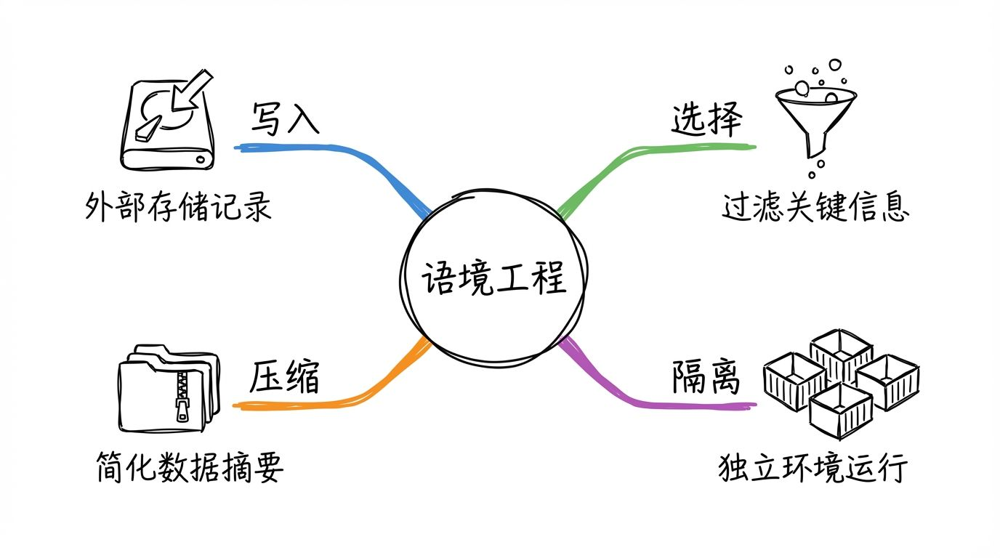
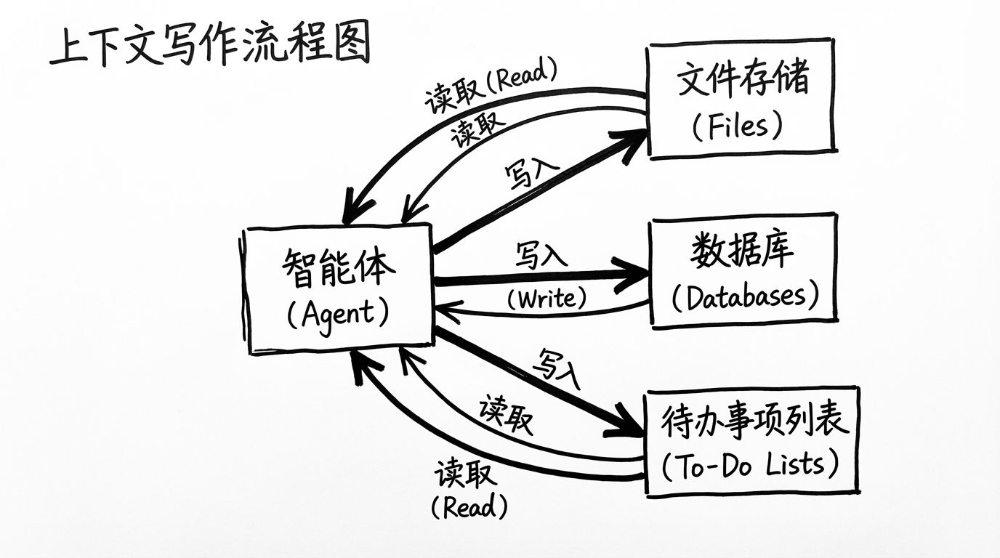
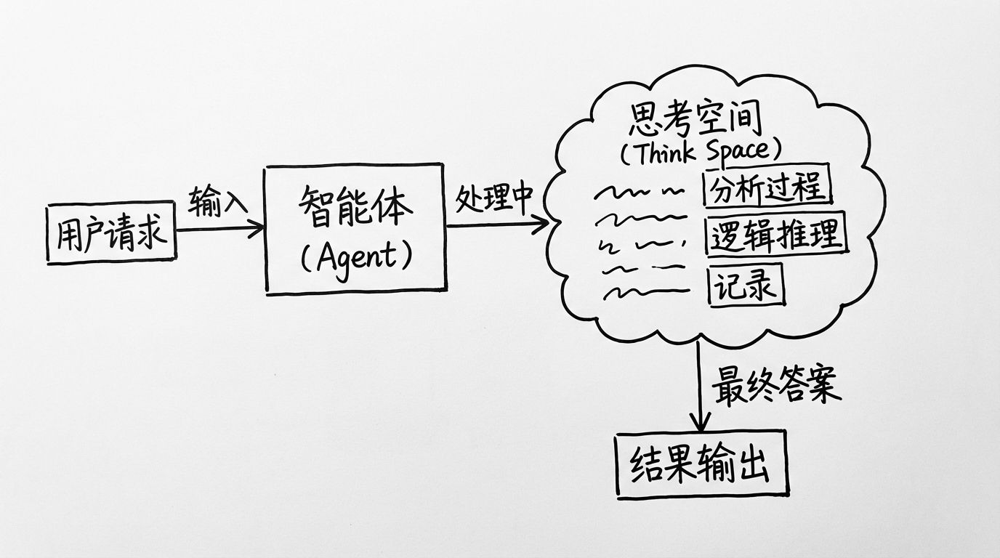
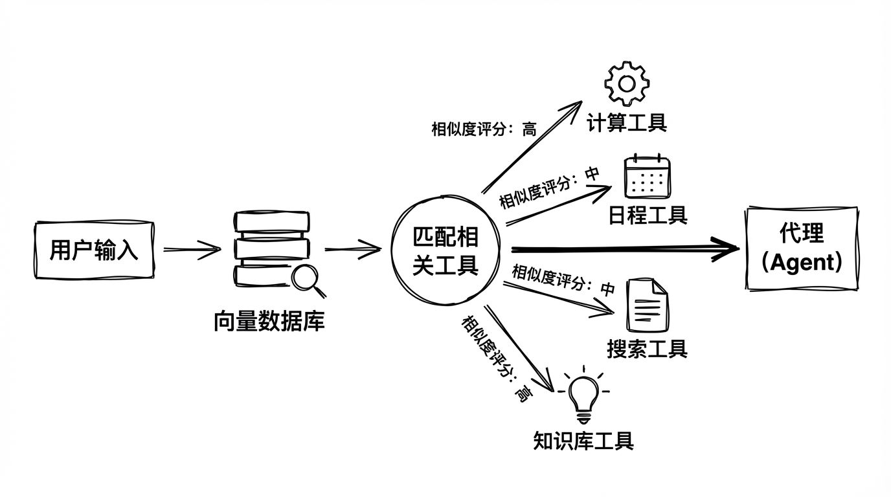
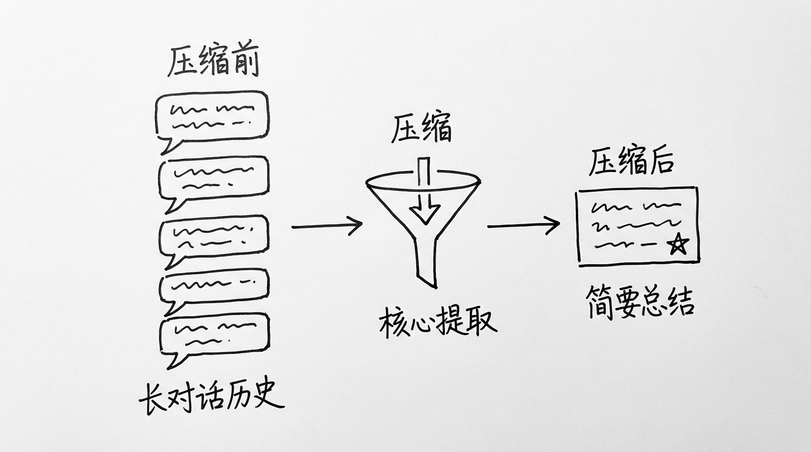
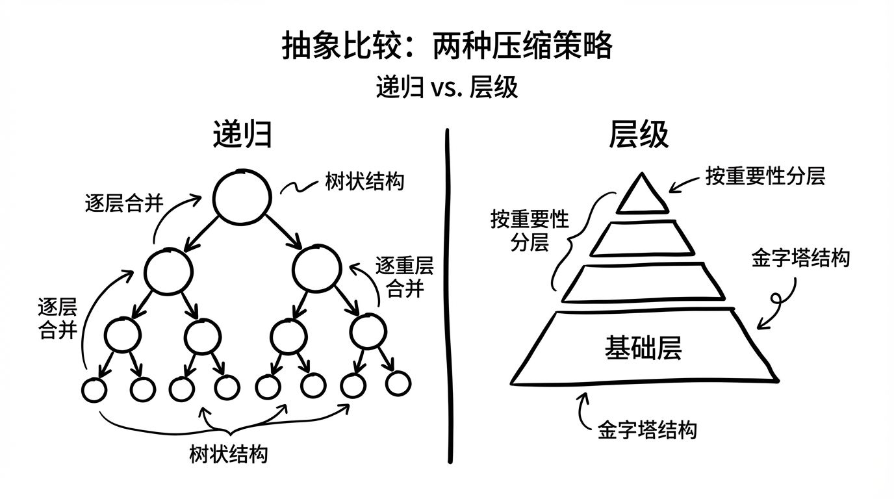
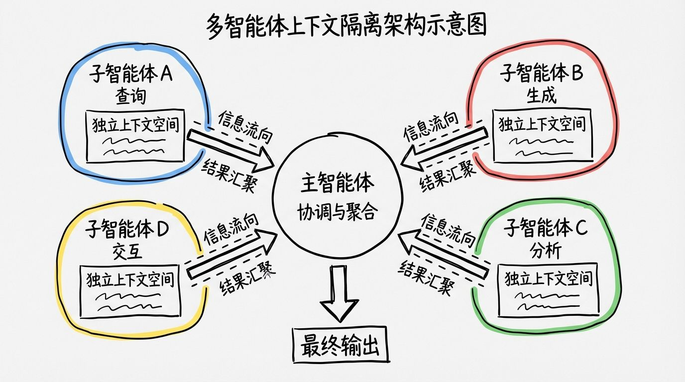

作为上一篇文章的延续，我们现在可以聊聊业界在经过一年多的实践探索后，找到了哪些真正有效的方法来缓解上下文失效的问题。

在深入之前，让我们先快速回顾一下上下文可能失效的几种典型方式。这些问题你可能在实际使用中已经遇到过，只是当时没有意识到背后的原因。

首先是上下文污染。当幻觉或错误信息进入上下文后，模型会反复思考这些错误内容，就像陷入了一个思维陷阱，不断朝着错误的方向前进。这会导致整个项目逐渐偏离你的目标，而且越走越远。

然后是上下文分散。当上下文变得太长时，模型会过度关注历史对话内容，反而忽略了它在训练期间学到的知识。这就像一个人被太多琐碎信息淹没，开始循环依赖那些早期的、其实并不靠谱的尝试。这些早期尝试往往缺乏足够依据，需要不断纠正，但模型却把它们当成了金科玉律。这会导致性能严重下降，甚至出现冥顽不化的现象。

第三个问题是上下文混乱。当多余的、不相关的信息被模型用来生成响应时，质量自然会下降。更糟糕的是上下文冲突，当新信息与历史信息发生矛盾时，模型的思路就会变得混乱不堪。

这一切都与上下文工程的管理有关。上下文中的每一个细节都会影响模型的最终响应，我们又回到了那句经典的计算机格言：垃圾进，垃圾出。但幸运的是，在过去一年多的工程实践和研究探讨中，社区涌现出了许多策略来缓解这些问题。

那么在 2026 年的今天，我们该如何应对这一挑战呢？我把智能体上下文工程的常见缓解策略分为四个类别：写入、选择、压缩、隔离。接下来，我会通过一些流行的智能体产品和论文，给你展示每种策略的实际应用。

## 写入上下文：在窗口之外构建记忆

写入上下文的核心思想是将信息保存在上下文窗口之外，让智能体可以随时调取。这听起来很抽象，但其实我们人类一直在这么做。想想你自己解决复杂问题的过程，你不会把所有信息都塞在脑子里反复思考，对吧？你会做笔记、画图表、列清单，把重要信息外化到纸上或电脑里。智能体的写入策略本质上就是在模仿这个过程。

这种策略的实现方式其实很灵活。它可以通过工具调用来完成，比如 Claude Code 会创建一个待办事项列表，把任务拆解和进度记录在那里。它也可以简单地通过提示词引导，让智能体把关键信息写入文件，然后在需要时再读取。还有一种方式是在智能体运行时的状态字段中持久化保存，这样在整个会话期间信息都不会丢失。

无论采用哪种实现方式，目的都是一样的：让智能体能够实时保存最有价值的信息，而不是让这些信息淹没在越来越长的上下文流中。这种策略以最小的开销提供持久化的记忆，允许智能体在会话中跨越复杂问题，追踪进度，维护关键上下文和依赖关系。否则的话，面对长时间、多步骤任务，这些任务记录的信息很可能会在数十次甚至上百次的工具调用中丢失。

记忆机制的主要作用是帮助智能体在给定的会话或线程内解决问题，但有时也可以让智能体受益于多个会话之间的信息共享。Reflection 这篇论文引入了一个有趣的想法：在每个智能体轮次后进行反思，并重新使用这些自然生成的记忆。更进一步的是深层记忆机制，它可以从过去智能体的反馈中定期合成记忆，来更新或创建新的记忆条目。

这些概念已经进入了一些流行的产品。比如 ChatGPT、还有 gemini 的记忆功能，都是这方面的典型体现。它们都基于用户与智能体的交互自然生成记忆，形成可跨会话长久持久存在的长期记忆机制。

当我们新开一个会话导致上下文重置后，智能体可以读取自己的笔记，并继续完成任务。这种跨越多个步骤的连贯性，使得将所有信息保存在大模型上下文窗口中无法实现的长时间策略变成了可能。

比如 Claude Code 可以使用 think 工具。Anthropic 对该技术有一个非常详细的描述，详细介绍了他们的 think 工具。基本上就是一个草稿板，他们的原文描述如下：使用 think 工具，我们可以让 Claude 包含一个额外的思考步骤，一个完整独立的空间作为获取答案的一部分。这在执行工具调用或对用户进行多轮对话时特别有用。

有一个专门记录笔记或进度的空间是非常有效的。这样做可以产生非常显著的效果，在专业智能体的评测上能提升 54% 的表现。Anthropic 确定了三种外载上下文的有用场景：

第一种是工具输出分析。当 Claude Code 需要在行动前仔细处理先前工具调用的输出，并需要回溯其方法时。

第二种是策略非常严苛且繁重的环境。

第三种是顺序决策制定的环境。当每个行动都需要建立在先前行动的基础上，且错误代价非常高昂的领域。

这些额外的思考空间外载到内存的方法是非常有效的。关于这个话题，我推荐另一篇详细的博客，那篇文章专门介绍了 ChatGPT 记忆运行的原理，感兴趣的朋友可以参考一下。
https://www.lapis.cafe/posts/technicaltutorials/chatgpt-memory-system-breakdown/

## 选择上下文：精准控制信息流

选择上下文意味着只选择指定的一部分上下文窗口来帮助智能体执行任务。选择机制取决于具体的实现方式。如果它是一个工具，那么智能体可以通过工具调用来简单地读取它。如果它是智能体运行时状态的一部分，那么开发者可以选择在每一步向智能体暴露状态的哪些部分。

这样做的好处是为后续轮次中向大模型传递上下文提供了更细粒度的控制。但这种方式也不是没有问题。最大的挑战是：你如何确定要保存什么样的相关内容？如何确定选择什么样的相关记忆才能确保它们是解决问题最需要的？

流行的智能体通常会使用一组简单的文件，这些文件总是会被拉入上下文中。比如在编程智能体中，大部分智能体都会选择使用特定的文件来保存程序性指令，或者在某些情况下保存特定的示例和情节记忆。Claude Code 使用 claude.md 文件，Cursor 则使用 .cursorrules 或 .cursorignore，Windsurf 这款 IDE 则使用 rules 文件，这些都是典型例子。

但如果智能体选择存储更大规模的规则、事实或关系集合，比如语义关系的集合，那就变得非常困难了。ChatGPT 就是这种方式的一个很好的例子，它可以存储大量用户特定的对话记忆，并从中形成特定的记忆片段，然后进行选择。

通过嵌入式数据库或知识图谱的方式用于记忆索引，通常有助于协助这个过程。但尽管如此，在智能体构建中，记忆选择和上下文选择依然是非常具有挑战性的。因为这种长期记忆的选择也会导致在当前对话中引入我们之前提到的几种问题，比如上下文干扰、上下文冲突，这些问题同样会存在。

在选择上下文的过程中，我们还有一个不得不面对的问题，那就是工具配置。在上一篇博客中我提到过，过多的工具配置同样会导致上下文冲突等一系列问题。所以工具配置也需要额外注意。

在每次任务中推荐的做法是：工具配置应该仅选择相关的工具定义到你的上下文中。配置这个术语借用自游戏领域，是指你在匹配或回合之前选择的能力组合，比如特定的能力、武器、装备等。通常你的配置是根据上下文量身定制的，考虑角色、关卡、团队成员构成以及你自己的技能组合。在这里，我用这个术语来代表为给定任务选择最相关的工具。

选择工具最简单的方法是将 RAG 应用到你的智能体工具描述中。有一篇论文 RAG-MCP 详细介绍了这一点。通过将工具描述存储在向量数据库中，他们能够根据输入提示词选择最相关的工具。

这种方法的好处是使用大模型驱动的 RAG 来动态选择工具，可以有效降低上下文中工具定义的占比和消耗。更重要的是可以降低大模型的推理功耗和提升速度，而这些都是在边缘端部署时的关键指标。这里有个有趣的发现，即使动态工具选择并不能显著改善模型最后的推理结果，但功耗的节省和速度的提升本身就是巨大的价值。想象一下，如果你的智能体运行在移动设备或嵌入式系统上，每节省一点功耗都意味着更长的续航时间，每提升一点速度都意味着更好的用户体验。

幸运的是，大部分智能体的任务处理并不会特别复杂，往往只需要几个手工策划的工具就能搞定。但如果你的任务所需功能的广度或深度远远超过了集成工具的数量，需要扩展到几十个甚至上百个工具时，那你就明显需要认真考虑工具配置的问题了。

我们在上面详细提到了两点，上下文的裁剪和工具的配置选择。实际上它们都出于同一个想法，通过精准的选择来尽量减少上下文的使用，让智能体只看到它真正需要的信息。

## 压缩上下文：形成高质量摘要

智能体在交互时可以跨越数百轮对话，并使用密集的 token 进行工具调用。摘要是解决上下文管理的一种常见方法。

最经典的例子是 Claude Code。如果你使用过 Claude Code，你就能看到这一点的实际应用。当你使用超过上下文窗口的 95% 后，Claude Code 会运行自动压缩，它会摘要用户或智能体交互的完整轨迹。

这种跨对话的压缩可以使用各种各样的策略，比如递归策略或分层策略。随着模型上下文窗口的不断增加，智能体构建者可以发现，总结除了能确保总 token 数在上下文限制之内，还有其他好处，那就是可以解决上下文分散的问题。

让模型总结一段对话的上下文还是比较容易的。但你如何确保总结后的上下文对智能体来说仍然是完善的？知道该保留什么内容，并将其详细说明给下一个大模型会话，这对智能体构建者来说非常重要，也是一个很困难的问题。

这个功能很有用，比如它可以用于某些后处理工具调用，像搜索工具、读取文件这些 token 密集型的工具。如何有效实现这个目的同样值得考虑。有人会选择使用递归式摘要，有人会选择分层式摘要，甚至有些智能体构建厂商会专门微调一个轻量级的总结模型来处理这个任务。

压缩上下文的艺术在于选择保留什么和丢弃什么。过度激进的压缩可能会导致丢失微妙但非常关键的上下文，这些上下文的重要性可能会在某个步骤中突然显现出来。

最容易处理的方法是清理掉过去工具调用的中间过程。一旦工具在消息历史中被调用过，智能体为什么还需要看到调用过程中产生的所有数据呢？我们只需要保存最后的结果就好了。最安全、最轻量级的压缩方式就是选择清除工具调用的中间结果。
## 隔离上下文：分而治之的智慧

上下文隔离是指让每个智能体在各自专用的线程中隔离彼此的上下文，每个线程有单独的大模型实例来使用。当上下文不太长，且不包含不相关内容时，没有了上下文分散的问题，我们通常都可以看到模型会提供出更好的结果。

有许多这种策略的例子。一个容易理解的描述来自多智能体架构设计系统。他们(claude)写道：搜索的本质就是压缩，从庞大的语料库中提炼出见解。每个子智能体都可以通过在各自的上下文窗口中并行操作来促进压缩。在将最重要的信息传递给主智能体时，同时探索问题的不同方面，每个智能体还能提供关注点分离、不同的工具、提示词，甚至是探索方法。这都减少了路径依赖，并能支持更加彻底独立的调查。

最明显的例子是深度研究很适合这种设计模式。当给出一个问题时，可以识别出对应的几个子问题或探索领域，并使用多个子智能体进行分别的搜索。这不仅加快了信息的收集和提炼，也可以防止单个大模型上下文积累太多杂乱的信息，或者与给定提示词不相关的信息，从而能够提供出更好的结果。

这种方法同样有助于工具配置。因为智能体设计者可以设计出几个智能体原型，每个都有自己专用的配置和如何使用每个工具的指令。

智能体构建者的挑战是找到任务能够隔离的角度，将每个任务分成几个子任务，分离到单独的线程对话中。当然，如果任务需要在多个智能体之间构建共享上下文，那就不太适合这种策略了。

### 使用环境进行上下文隔离

这是隔离上下文的另一个方向。比如 Hugging Face 的研究员展示了上下文隔离的另一个有趣例子。大多数智能体使用工具调用的 API，它返回可以传递给工具的搜索结果或工具反馈的 JSON 对象。Hugging Face 通过使用 Code Agent，它会输出所需工具调用的代码，然后代码在沙箱中运行，可以指定工具调用的上下文，然后传递回给大模型。

这样的话，沙箱就可以把一部分上下文从大模型中隔离开来。Hugging Face 注意到，这是隔离 token 密集对象的一种绝佳方式。如果我们允许的话，甚至可以不只是单纯搜索文件，还可以通过图像、音频、视频这种方式来获取内容。

## 总结

上下文工程已经变成了智能体构建必须掌握的一门技术，或者说是艺术。在这篇文章中，我们讨论了四种在今天许多流行智能体中都已经看到的常见模式：

写入上下文，将部分上下文保存到上下文窗口以外，并在需要时随时拉取回来，帮助智能体更好地执行任务。

选择上下文，将上下文窗口中的某一部分传入，帮助智能体更好地执行任务。

压缩上下文，仅保留执行任务所需的 token。

隔离上下文，将上下文分割到不同的会话中，帮助智能体更好地专注于每个小任务。

这四种策略不是孤立的，它们可以组合使用，相互补充。理解它们背后的原理，能帮助你在构建智能体时做出更明智的选择，避免那些常见的上下文陷阱。

引用:
https://openai.com/index/unrolling-the-codex-agent-loop/
https://arxiv.org/pdf/2507.13334
https://www.anthropic.com/engineering/effective-context-engineering-for-ai-agents
https://www.blog.langchain.com/context-engineering-for-agents/
https://www.dbreunig.com/2025/06/22/how-contexts-fail-and-how-to-fix-them.html
https://www.dbreunig.com/2025/06/26/how-to-fix-your-context.html