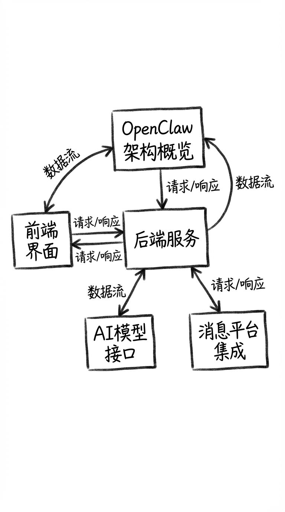
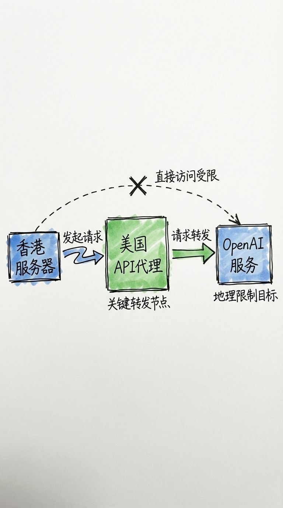
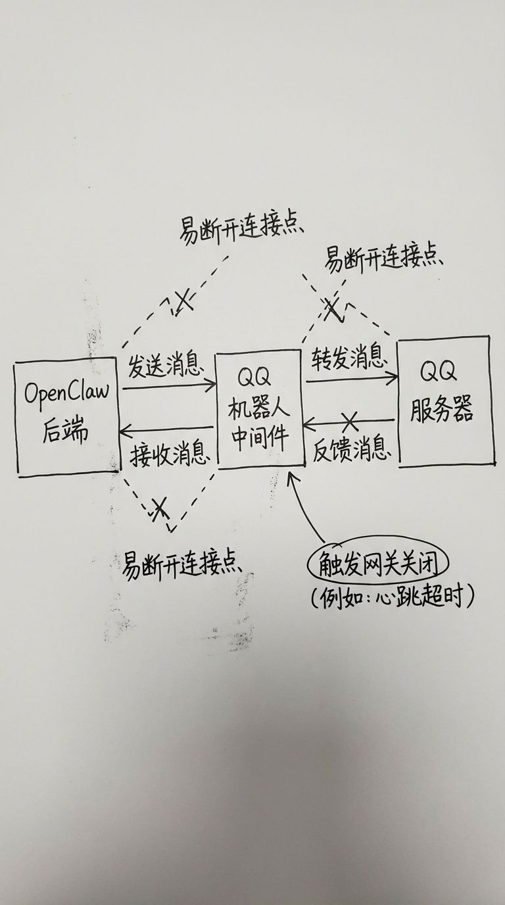
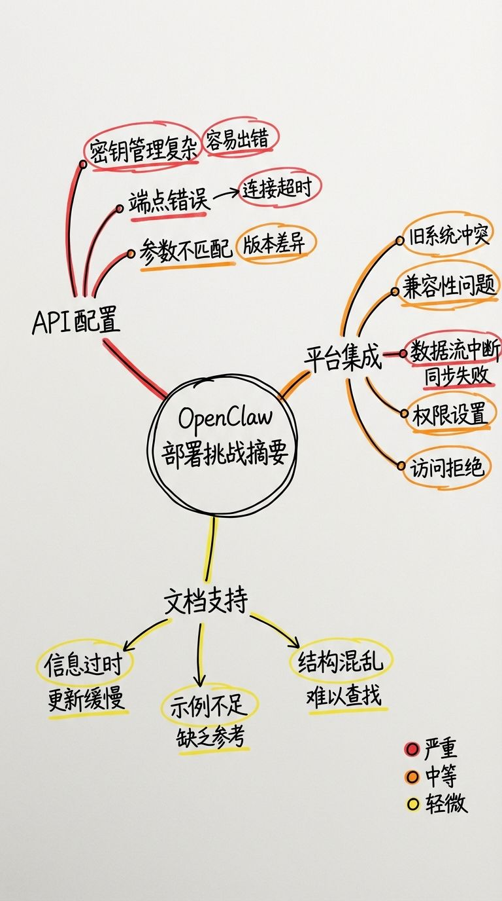

# 一次失败但有价值的OpenClaw部署之旅

最近OpenClaw火得一塌糊涂。之前我在本地电脑上试过几次,但因为没有独立的云服务器,本地环境又不稳定,体验实在不太好,就暂时搁置了。直到最近入手了一台配置不错的云服务器,我才重新燃起了折腾的热情,想着一定要把这个AI助手跑起来。

从昨天下午开始到今天,我经历了无数次尝试、调试、报错、重来,最终还是选择了放弃。就像OpenClaw作者Peter说的那样,这个项目确实引领了一个潮流,但坦白说,它现在还处于早期阶段,对于非专业开发者来说,部署门槛实在太高了。我相信再过几个月,市场上会出现更成熟的商业级产品,那时候的使用体验会好很多。

## 第一关:API配置的重重障碍

我的第一印象是配置过程相当繁琐,特别是对新手来说。虽然配置好之后使用起来还算方便,但初次接触时各种问题接踵而至。我一开始想走捷径,在网上找了各种一键安装脚本,结果发现每个脚本都有自己的坑。

最大的问题出在API配置上。我的云服务器在香港,但我使用的是OpenAI的美国密钥,这就产生了地域限制问题。为了绕过这个限制,我采用了一个相对复杂的方案:先通过美国的云托管服务部署了一个API代理,然后在本地通过NewAPI连接到那个容器,这样才勉强把链路打通。

但问题还没结束。我发现密钥配置总是出错,系统不能直接识别最新的GPT-4o模型,只显示GPT-4的选项。这让我在测试时陷入了困境:到底该用OpenAI的原生格式,还是兼容格式?经过反复测试,我发现NewAPI部署的服务应该使用原生格式,但这个过程真的耗费了大量时间。

更让人崩溃的是,即使配置正确了,系统也不支持GPT-4o模型,只支持GPT-4和GPT-4-turbo。这个限制让我又折腾了好久。最后我干脆没看教程,直接用Claude Code配合GPT-4o让AI帮我调试配置,总算是把API密钥这一关过了。

## 第二关:QQ机器人接入的噩梦

API配置好之后,下一步就是接入消息平台。由于我没有Telegram、Discord等国外账号,自然把目光投向了国内的选择。个人微信接入机器人太不现实,企业微信又要走一堆认证流程,飞书也需要在平台上注册认证,我嫌麻烦,最后选择了QQ机器人。

这个选择让我陷入了更深的泥潭。腾讯官方不愿意开源机器人插件,非要在腾讯云上购买服务器才能使用官方方案。我只好在GitHub上找了一个第三方的开源QQ机器人项目,然后新的噩梦开始了。

配置完成后,QQ机器人确实能和OpenClaw正常对话了,那一刻我真的特别兴奋。但折磨人的地方马上就来了:机器人老是断连。更糟糕的是,我发现云服务器的网关有问题,它会自动关闭连接。我是通过SSH远程登录服务器,在终端执行命令启动服务的,但只要我关闭终端窗口,服务就会自动停止。

当我发现这个问题时,已经苦恼了很久。有时候能正常工作,有时候不行。最致命的一次,我等了一个多小时都没等到机器人回复,后来登上服务器才发现,原来是我关闭了终端,服务就自动断开了。这个问题后来通过使用screen或nohup命令解决了,但当时真的让我抓狂。

第二个更大的坑是QQ平台本身的限制。我不确定这是腾讯官方的设置还是第三方机器人的问题,总之它的限制极其严格:请求参数里不允许有URL,发送消息时不允许包含Markdown格式,这让我折腾得够呛。即使网关正常运行,很多时候也无法正常使用。

到这里,我彻底放弃了国内QQ的方案。

## 第三关:Discord接入的最后一击

既然国内方案行不通,我决定老老实实接入国外官方支持的平台。参考项目文档,我选择了Discord。虽然我之前没有Discord账号,但想着官方支持应该会顺利一些。

结果又是一个折磨的过程。第一个问题让我差点吐血:我的VPS的DNS被污染了,无法正常访问Discord的API。当我按照教程配置好所有参数后,这个问题困扰了我很久。

在这个过程中,我发现了一个有价值的经验:面对这种比较新颖的项目配置问题,问Perplexity这类AI搜索引擎效果要好得多。像ChatGPT和Claude,它们的训练数据相对滞后,无法捕获到最新的问题和解决方案,修复效果不太理想。

经过一番艰难险阻,DNS问题终于解决了。但不要高兴得太早,新的问题又出现了:我的API突然无法正常工作,一直报"Connection Error"。明明API配置没动过,同样是在同一台服务器上部署的,就是连不上。我反复检查了配置文件、网络连接、防火墙设置,尝试了各种可能的解决方案,最终还是没能解决。

到这里,我彻底放弃了。

## 复盘与思考

这次失败的部署经历虽然没有达成目标,但让我对OpenClaw这个项目有了更深入的理解。我看到的是,这个项目确实代表了AI助手的一个重要方向,它的理念和架构都很先进,但当下的成熟度还不足以支撑大规模的普及使用。

对于非专业程序员来说,部署难度主要体现在几个方面:

首先是API配置的复杂性。地域限制、模型版本兼容性、格式选择等问题,每一个都可能让新手卡住很久。这背后反映的是OpenClaw在API抽象层做得还不够好,没有很好地屏蔽掉底层的复杂性。

其次是消息平台集成的不稳定。无论是国内的QQ还是国外的Discord,都存在各种各样的连接问题、限制问题。这说明项目在适配不同平台时,还没有形成一套稳定可靠的方案。

最后是文档和社区支持的不足。很多问题在官方文档里找不到答案,社区里的讨论也比较分散,新手很难快速找到解决方案。这是所有早期开源项目的通病,需要时间来积累。

我依然相信OpenClaw的发展潜力。它引领的这个方向是对的,只是现在还处于早期探索阶段。或许再过一两个月,国内外的各种竞品就会涌现出来,那些商业化的产品会把部署流程简化到几分钟内完成,把各种平台的集成做得更稳定,把用户体验打磨得更好。

到那个时候,或许就是真正的"贾维斯时刻"了。而我这次失败的经历,也算是为那个时刻的到来,做了一次小小的探路。

## 参考资源

如果你也想尝试部署OpenClaw,这些资源可能会对你有帮助:

- [将QQ接入OpenClaw的详细教程](https://laosu.tech/2026/02/01/%E5%B0%86QQ%E6%8E%A5%E5%85%A5OpenClaw%E7%9A%84%E8%AF%A6%E7%BB%86%E6%95%99%E7%A8%8B/#%E5%AE%89%E8%A3%85-QQ-%E6%8F%92%E4%BB%B6)
- [OpenClaw部署经验分享 - 知乎](https://zhuanlan.zhihu.com/p/2001934699661137919)
- [腾讯云OpenClaw部署指南](https://cloud.tencent.com.cn/developer/article/2626068)
- [OpenClaw训练教程](https://yanfukun.com/read/openclaw/xunlian)
- [OpenClaw部署视频教程](https://www.youtube.com/watch?v=AuMqlaC8Yqs)
- [OpenClaw Wiki完整指南](https://yanfukun.com/read/openclaw/openclaw-wiki-guide-20260201)

注:受限于心态,实在是不想单独截屏各种情况了,所以只有文字描述.
