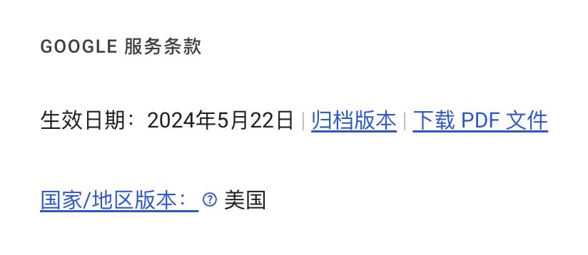
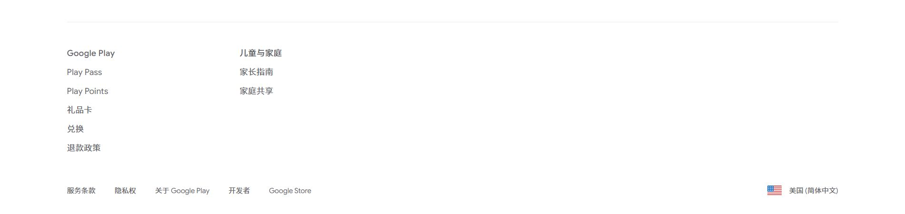
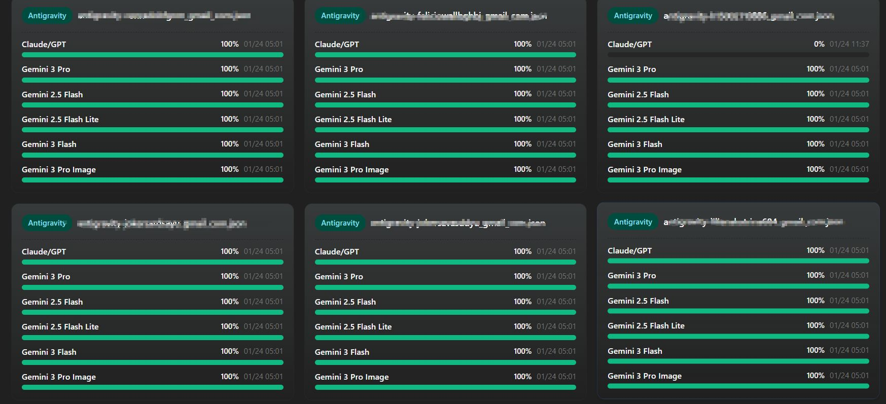

# Google 家庭组建站指南：从零到 AI 自由

最近我自己想要组建自己的家庭组升天流, 但是遇到不少组建 Google 家庭组的问题，我把自己踩过的坑和摸索出来的经验整理了一下，希望能帮到想要白嫖 Google AI 福利的朋友们。本文会从账号准备、Pro 开通、家庭组组建到具体使用渠道，完整地走一遍流程。

---

## 第一步：账号的准备与管理

### 1.1 Google 账号的获取

Google 账号是整个流程的基础，获取方式主要有两种：自行注册或直接购买。

**自行注册**适合有时间、有耐心的用户。新注册的账号需要养一段时间才能正常使用——所谓的"养号"，其实就是模拟正常用户的使用行为，每天登录看看视频、收发邮件、刷刷 TikTok，大约一周后就比较稳定了。

**直接购买**是更快捷的方式。我个人推荐购买美区账号，原因很简单：美区账号在后续使用中遇到的问题最少，生态最成熟。市面上美区普通账号的价格一般在 10 元左右浮动，而一个干净、长期使用的账号会贵一些。**这里有个重要的经验**：刚拿到手的新号，无论是自己注册的还是买的，前几天一定要规规矩矩地使用，不要急着改密码、绑定 2FA 或者更换邮箱，这些操作极易触发风控。最好固定一个稳定的 IP 登录，让系统把你识别为一个"活人"，这对后续的管理和风控都大有裨益。

### 1.2 账号的"地区"概念

这是很多新手容易混淆的概念。Google 账号其实有三个归属地区的判定，但是我们关于家庭组只需要下面的两个地区就好了,你需要理解它们的区别：

**服务条款归属地**是最基础的一个。除非你主动申请修改，或者 Google 系统发现你长期在某个国家使用从而自动切换，否则这个归属地基本不会变。对家庭组来说，这个地区不一致通常不影响使用。
可以通过如下方式检查 
访问 [https://policies.google.com/terms](https://policies.google.com/terms) 以检查账号区域，不放心的可以自己调整，当然调整这个不是重点，可以自行谷歌。
这里简单介绍一下，主要是访问 [https://policies.google.com/country-association-form](https://policies.google.com/country-association-form) 并填写申请，理由选其他，内容填 **For my academic work, I require access to Gemini. Please assist me in setting my location to the U.S.**，然后等待验证就好，但是不是一定过好吧，至少我发出两天都没有回应应该是直接拒绝了，这个方法就对于账号的 IP 使用要求严格了，最好一个月固定到你想要修改的那个地区去。

**Google Play 归属地**才是关键中的关键。家庭组的绑定主要就是判断这个地区是否一致——主号和普号的 Play 归属地必须相同才能加入同一个家庭组。我自己的实际情况是：服务条款是日区，支付区域是美区，这种组合依然可以正常使用。这说明两个区域不必完全一致，**但支付区域必须匹配你打算加入的家庭组地区**。

检查该地区的方法：访问 [https://play.google.com/store/games?device=windows](https://play.google.com/store/games?device=windows) 并拉到最底部以检查Play区域

理解这一点非常重要。很多新手失败的原因就是普号的支付地区和主号对不上，导致怎么也加不进去家庭组。

---

## 第二步：Pro 账号的开通

### 2.1 学生验证资格

要开通 Google One AI Pro（也就是所谓的 Pro 号），首先需要获得学生会员资格。没有这个资格，后续一切都免谈。
关于资格获取，网络上有很多经验分享，我自己也实践过。核心思路是：**保持一个固定的好 IP，持续使用一段时间，假装自己是个普通用户**。系统会随机判定账号是否符合资格，多试几次大概率能刷出来。注意期间不要频繁更换 IP，尽量表现得像一个真实在使用的美国人（划掉，只要固定到符合谷歌政策的 Ip 地址就好了）。

### 2.2 学生验证的具体操作

如果你的账号幸运地获得了资格，接下来就是正式的验证环节。
**重要提示**：不要直接点击学生验证页面入口。如果你不是真正的美国大学生，**大概率会验证失败**。国内用户需要借助一些第三方工具。
目前比较推荐的是 OneKey 网站。这个平台可以通过积分兑换 CDK 来获取免费验证次数，如果觉得麻烦，也可以直接花钱购买验证机会，1 元钱 10 次，价格很良心。一般 1 块钱够你用很久了，用不完甚至可以分享给朋友。
https://batch.1key.me/
我没有收钱啊，遇到问题不要找我啊，或者去 tl 蹲着也可以，麻烦主要是。
### 2.3 绑卡环节
验证通过后，下一步是绑定支付方式。这里同样有讲究。
市场上虚拟卡的价格一般在 3 到 5 元之间，不要被骗了。需要注意的是，学生验证可能会涉及预扣款验证，所以**一刀（1 美元）的虚拟卡就足够了**，这种卡一般在 5 元左右。
综合算下来，自己动手开通一个 Pro 号的成本大约是：美区账号 10 元 + 学生验证 1 元 + 虚拟卡 5 元 = 16 元左右。如果愿意花三四十元直接买一个成品号也行，但自己动手能省不少，主要是贫穷了。
至于绑卡的话，看你买的卡的商家是怎么要求的，大概也就是保证环境的稳定就可以了，并且正常验证一般都会时间比较长，如果你的账号绑卡马上就弹出人机验证了，基本上不用继续了，大概率不通过，这个时候就不要多尝试了，直接换卡比较好。

---

## 第三步：组建家庭组

### 3.1 主号的操作
有了 Pro 号之后，组建家庭组的流程其实不复杂。
首先，用 Pro 号访问 [https://one.google.com/u/1/settings?utm_source=gemini&utm_medium=web&utm_campaign=gemini_manage_plan&g1_landing_page=0&otzr=1](https://one.google.com/u/1/settings?utm_source=gemini&utm_medium=web&utm_campaign=gemini_manage_plan&g1_landing_page=0&otzr=1) 并点击“管理家庭设定”，创建一个家庭后回到该界面勾选”与家人共用 Google One“。然后在添加成员的界面，向你的普号发送邀请。

### 3.2 普号的准备

普号同样需要养几天再用，不要刚拿到手就急急忙忙去加入家庭组。关于普号的地区选择，记住一点：**普号的支付地区必须和主号的支付地区一致**。如果主号是美区的，就买美区普号；是日区的就买日区普号。这是地区不匹配导致失败的常见原因。
如果地区不匹配，就需要修改普号的支付地区。方法是创建新的支付资料：先把旧的关掉然后在对应地区创建新的支付资料就好了。这个好像不要求卡是真的，随便找个虚拟地址生成一下就好了，同样可以修改地区。
还有一个问题就是进入Gemini网页版后会提示Something went wrong。这种情况下，需要访问 [https://gemini.google.com/gems/create?hl=en-US&pli=1](https://gemini.google.com/gems/create?hl=en-US&pli=1) 来创建一个Gem。保存后即可尝试进行对话，没问题的话继续。，如果还是不行，这个账号可能本身就存在问题。

### 3.3 接受邀请与验证
普号收到邀请后接受，然后访问 Gemini 页面检查是否成功加入。成功的标志是：界面显示 Pro 专属的彩色光圈，左侧有 Pro 标志。如果只有彩圈没有 Pro 标志，说明账号状态不正常，需要排查原因。
状态正常的标志：

状态不正常的标志（或左侧有Upgrade的提示）：

如果状态不争取，大概率是**年龄认证问题**，如果遇到年龄认证要求，可以参考下面的解决方式：
一是修改生日。先改到未成年状态（比如 2008 年），保存后再改回成年状态，系统会要求你验证年龄。如果有信用卡，直接用信用卡验证最方便，但注意不要虚拟卡，有一定概率失败。
二是走人工审核通道，使用身份证配合 AI 生成的证件照进行验证。成功后邮箱会收到通知，再次进入 Gemini 就能看到 Pro 权益了。
**重要提醒**：修改年龄风险很大，容易触发风控。如果账号本身没问题，只是暂时卡在年龄认证，建议人工等几天系统自动处理，不要轻易动手。

---

## 第四步：AI 服务使用渠道
组建好家庭组后，真正的重头戏来了——如何最大化利用你的 Pro 权益。目前主要有三个渠道可供选择。
### 4.1 AI Studio 逆向
这是最基础的方式。登录 Google AI Studio 页面，启用服务后，通过一些开源的逆向项目可以调用 API。
这种方式的缺点很明显：网页端上下文短，不支持工具调用，只能做简单的对话，用途有限。但门槛低，适合新手入门。
这里不做推荐了，自己寻找。
### 4.2 Gemini cli（重要）

gemini cli是使用 gemini 3 比较推荐的渠道。普号开通 Pro 后，一般不会再受到 403 限制，可以尝试登录使用。
如果遇到服务端拒绝请求的情况（比如说常见的 403），通常是因为没有开通 Google Cloud 的 API 权限。解决方法是：进入 Google Cloud 控制台，搜索所有包含 Gemini API 的服务，全部启用即可。操作很简单，多点几下鼠标的事，不费什么功夫。 
https://console.cloud.google.com/
验证成功后，就可以在 GitHub 上找一些反代项目愉快地使用了。登录 Gemini 命令行时，可以在设置里打开模型预览，启用 Gemini 3 Pro，这样就能用上更新的模型，否则只能用 2.5 系列。
我自己用的是 CliProxyapi 这个项目，体验非常好，推荐试试。

### 4.3 反重力Antigravity（爽吃）

Antigravity（俗称反重力）可以说是目前最大方的 Google AI 渠道了。它提供 Claude  系列模型和 Gemini 3 的访问权限，额度相当慷慨。

如果你已经能通过 gemini cli正常使用，登录反重力的 IDE 就不是必须的了——很多反代项目可以直接调用反重力 的模型额度。我个人不太喜欢用它的 IDE，电脑上甚至没装，直接用授权文件更省事。
项目目前很多, 我自己同样使用的是 cliproxyapi.
**关于额度限制**：反重力的额度目前消耗很快，Google 已经调低了很多的配额。而且多次触发 5 小时限额后，系统可能会把你的限制周期提升到 3 天甚至 7 天，非常影响使用。
**解决方案**：多建几个号轮着用，不要把一个号用到触发长期限额。每个账号的额度是独立的，分散使用可以最大化利用资源。
Claude和 gpt 的额度是共享的，建议直接用最好的模型，或者切换到 Claude 也可以。反重力按次计费，某些客户端可能会消耗得比较快，建议少用 MCP、连续思考这类高消耗次数的功能，额度杀得太快。
最后成品图。

---

## 第五步：成本总结
最后来算一笔账，让自己动手的朋友心里有个数：

| 项目     | 成本         |
| ------ | ---------- |
| 美区普号   | 约 10 元     |
| 学生验证   | 约 1 元      |
| 虚拟卡    | 约 5 元      |
| **合计** | **约 16 元** |

如果选择购买成品号，一般 30 到 40 元是一个 Pro 号的正常价格。嫌麻烦直接买也行，但自己动手成本更低，而且过程中遇到问题也知道怎么解决。
悠着点玩，额度是有限的，别太上头。祝大家玩得开心，有问题可以交流讨论。

不做任何渠道购买的推荐, 这个大家就不用问了.
---

*以上内容基于个人实践经验整理，如果你有更好的方法或遇到了我没提到的问题，欢迎一起探讨。*

本文参考了以下的文章经验：
https://linux.do/t/topic/327898
https://linux.do/t/topic/1315231
https://linux.do/t/topic/1406215